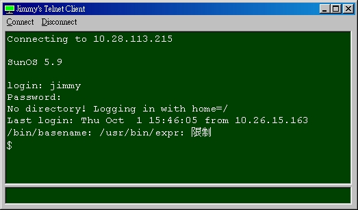



## Telnet Client implements telnet protocol

### Description

I searched the telnet client for long time, but I don't know why the vb codes I found from psc didn't work in my environment. So I tried to code it myself. Now it works fine. I do not implement the key map, because I just use the telnet function as part of my project. Such as auto script and network management(using multiple telnet client of control array). I think it is useful so I share the telnet part. Hope it helpful to you.
 
### More Info
 

             |
---                |---
**Submitted On**   |2009-10-01 06:10:02
**By**             |[Red Corn](https://github.com/Planet-Source-Code/PSCIndex/blob/master/ByAuthor/red-corn.md)
**Level**          |Beginner
**User Rating**    |5.0 (15 globes from 3 users)
**Compatibility**  |VB 6\.0
**Category**       |[Complete Applications](https://github.com/Planet-Source-Code/PSCIndex/blob/master/ByCategory/complete-applications__1-27.md)
**World**          |[Visual Basic](https://github.com/Planet-Source-Code/PSCIndex/blob/master/ByWorld/visual-basic.md)
**Archive File**   |[Telnet\_Cli2163931012009\.zip](https://github.com/Planet-Source-Code/red-corn-telnet-client-implements-telnet-protocol__1-72506/archive/master.zip)

